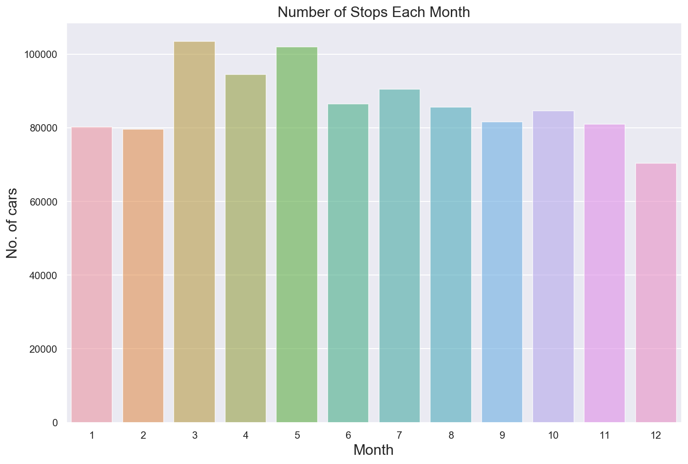

     No     0.982502
    Yes    0.017498
    Name: Personal Injury, dtype: float64 
    
    
    Property Damage 
     No     0.970458
    Yes    0.029542
    Name: Property Damage, dtype: float64 
    
    
    Fatal 
     No     0.999703
    Yes    0.000297
    Name: Fatal, dtype: float64 
    
    
    Commercial License 
     No     0.968102
    Yes    0.031898
    Name: Commercial License, dtype: float64 
    
    
    HAZMAT 
     No     0.999884
    Yes    0.000116
    Name: HAZMAT, dtype: float64 
    
    
    Commercial Vehicle 
     No     0.993881
    Yes    0.006119
    Name: Commercial Vehicle, dtype: float64 
    
    
    Alcohol 
     No     0.997777
    Yes    0.002223
    Name: Alcohol, dtype: float64 
    
    
    Work Zone 
     No     0.999727
    Yes    0.000273
    Name: Work Zone, dtype: float64 
    
    
    Search Conducted 
     No     0.869792
    Yes    0.130208
    Name: Search Conducted, dtype: float64 
    
    
    Search Disposition 
     Nothing                    0.455017
    Contraband Only            0.227850
    Property Only              0.183542
    Contraband and Property    0.133380
    DUI                        0.000210
    Name: Search Disposition, dtype: float64 
    
    
    Search Outcome 
     Citation              0.835663
    Arrest                0.102895
    Warning               0.058160
    SERO                  0.003275
    Recovered Evidence    0.000007
    Name: Search Outcome, dtype: float64 
    
    
    Search Reason 
     Incident to Arrest        0.654544
    Probable Cause            0.192376
    Consensual                0.117413
    K-9                       0.014670
    Other                     0.013794
    Exigent Circumstances     0.007081
    Probable Cause for CDS    0.000070
    Arrest/Tow                0.000053
    Name: Search Reason, dtype: float64 
    
    
    Search Reason For Stop 
     21-201(a1)       0.103308
    21-801.1         0.066838
    13-401(h)        0.049401
    16-303(c)        0.042212
    13-411(f)        0.041664
    21-1124.2(d2)    0.041289
    21-707(a)        0.037052
    21-801(b)        0.033543
    22-412.3(b)      0.025752
    21-202(h1)       0.021259
    Name: Search Reason For Stop, dtype: float64 
    
    
    Search Type 
     Both                 0.753808
    Person               0.134043
    Property             0.112097
    Search Incidental    0.000053
    Name: Search Type, dtype: float64 
    
    
    Search Arrest Reason 
     Stop         0.679153
    Search       0.147328
    Other        0.122009
    Warrant      0.050660
    Traffic      0.000520
    DUI          0.000165
    Marihuana    0.000118
    DWI          0.000047
    Name: Search Arrest Reason, dtype: float64 
    
    
    State 
     MD    0.868636
    VA    0.046042
    DC    0.024379
    XX    0.008423
    PA    0.007431
    TX    0.004948
    WV    0.004588
    FL    0.004587
    NC    0.003858
    NY    0.003143
    Name: State, dtype: float64 
    
    
    VehicleType 
     02 - Automobile              0.864328
    05 - Light Duty Truck        0.062282
    28 - Other                   0.020752
    03 - Station Wagon           0.016869
    06 - Heavy Duty Truck        0.010813
    01 - Motorcycle              0.009834
    29 - Unknown                 0.006062
    08 - Recreational Vehicle    0.003310
    19 - Moped                   0.001330
    25 - Utility Trailer         0.001098
    Name: VehicleType, dtype: float64 
    
    
    Year 
     2006.0    0.059939
    2007.0    0.059560
    2005.0    0.058614
    2004.0    0.057419
    2003.0    0.054440
    2008.0    0.053592
    2012.0    0.053470
    2013.0    0.050332
    2011.0    0.050181
    2002.0    0.049689
    Name: Year, dtype: float64 
    
    
    Make 
     TOYOTA    0.111269
    HONDA     0.109375
    FORD      0.098156
    NISSAN    0.054305
    TOYT      0.049781
    HOND      0.034364
    CHEV      0.029846
    BMW       0.028620
    DODGE     0.028105
    CHEVY     0.024710
    Name: Make, dtype: float64 
    
    
    Model 
     4S         0.105847
    TK         0.065118
    ACCORD     0.036475
    CIVIC      0.034748
    CAMRY      0.031727
    COROLLA    0.027789
    ALTIMA     0.018922
    SUV        0.016833
    4D         0.016116
    2S         0.016095
    Name: Model, dtype: float64 
    
    
    Color 
     BLACK         0.206841
    SILVER        0.178719
    WHITE         0.162575
    GRAY          0.113199
    RED           0.078570
    BLUE          0.074023
    GREEN         0.036513
    GOLD          0.031646
    BLUE, DARK    0.021718
    TAN           0.019437
    Name: Color, dtype: float64 
    
    
    Violation Type 
     Citation    0.689317
    Warning     0.290066
    ESERO       0.019778
    SERO        0.000840
    Name: Violation Type, dtype: float64 
    
    
    Charge 
     21-801.1         0.167620
    21-201(a1)       0.064339
    13-409(b)        0.042252
    13-401(h)        0.031605
    16-112(c)        0.031426
    16-303(c)        0.030104
    16-303(h)        0.029818
    16-101(a)        0.028596
    21-707(a)        0.024076
    21-1124.2(d2)    0.022441
    Name: Charge, dtype: float64 
    
    
    Article 
     Transportation Article    0.987335
    Maryland Rules            0.012622
    BR                        0.000021
    TG                        0.000018
    1A                        0.000004
    Name: Article, dtype: float64 
    
    
    Contributed To Accident 
     False    0.963103
    True     0.036897
    Name: Contributed To Accident, dtype: float64 
    
    
    Race 
     WHITE              0.355231
    BLACK              0.312978
    HISPANIC           0.225017
    ASIAN              0.053508
    OTHER              0.051445
    NATIVE AMERICAN    0.001821
    Name: Race, dtype: float64 
    
    
    Gender 
     M    0.683735
    F    0.314613
    U    0.001652
    Name: Gender, dtype: float64 
    
    
    Driver City 
     SILVER SPRING         0.242071
    GAITHERSBURG          0.104090
    GERMANTOWN            0.084384
    ROCKVILLE             0.078248
    WASHINGTON            0.030466
    BETHESDA              0.026692
    MONTGOMERY VILLAGE    0.026244
    HYATTSVILLE           0.024851
    POTOMAC               0.020262
    OLNEY                 0.016932
    Name: Driver City, dtype: float64 
    
    
    Driver State 
     MD    0.905442
    DC    0.031881
    VA    0.031190
    PA    0.005273
    FL    0.003165
    NY    0.002809
    WV    0.002252
    NC    0.002170
    CA    0.001607
    NJ    0.001437
    Name: Driver State, dtype: float64 
    
    
    DL State 
     MD    0.867637
    VA    0.033387
    DC    0.032078
    XX    0.018623
    PA    0.006332
    FL    0.005516
    NY    0.004297
    NC    0.003348
    CA    0.003169
    TX    0.002493
    Name: DL State, dtype: float64 
    
    
    Arrest Type 
     A - Marked Patrol                       0.757921
    Q - Marked Laser                        0.139470
    B - Unmarked Patrol                     0.033683
    S - License Plate Recognition           0.014239
    O - Foot Patrol                         0.011636
    L - Motorcycle                          0.009962
    E - Marked Stationary Radar             0.009512
    G - Marked Moving Radar (Stationary)    0.008860
    R - Unmarked Laser                      0.006355
    I - Marked Moving Radar (Moving)        0.002551
    Name: Arrest Type, dtype: float64 
    
    
    Geolocation 
     (0.0, 0.0)                               0.081944
    (39.0462766666667, -76.990695)           0.000285
    (39.045425, -76.9907366666667)           0.000279
    (39.11061, -76.9897983333333)            0.000116
    (39.0039, -77.036485)                    0.000115
    (39.057555, -76.9678266666667)           0.000111
    (39.109775, -76.91044)                   0.000088
    (39.0056183333333, -77.0123283333333)    0.000074
    (39.1492783333333, -77.06662)            0.000071
    (39.1822033333333, -77.263265)           0.000056
    Name: Geolocation, dtype: float64 
    
    
    


```python
df.replace(['?',], np.nan, inplace=True)
```


```python
#make list of var containing missing values
vars_with_na = [var for var in df.columns if df[var].isnull().sum()>1]

#print var name and % of missing values
for var in vars_with_na:
    print(var, np.round(df[var].isnull().mean(),3), '% missing values')
```

    Description 0.0 % missing values
    Search Conducted 0.581 % missing values
    Search Disposition 0.946 % missing values
    Search Outcome 0.6 % missing values
    Search Reason 0.946 % missing values
    Search Reason For Stop 0.582 % missing values
    Search Type 0.946 % missing values
    Search Arrest Reason 0.96 % missing values
    State 0.0 % missing values
    Year 0.006 % missing values
    Make 0.0 % missing values
    Model 0.0 % missing values
    Color 0.013 % missing values
    Article 0.021 % missing values
    Driver City 0.0 % missing values
    Driver State 0.0 % missing values
    DL State 0.001 % missing values
    


```python
drop_column = ['SeqID','Agency','Description','Location','Latitude','Longitude','Accident', 'Belts','Personal Injury', 'Property Damage','Fatal','Commercial License','HAZMAT','Commercial Vehicle','Alcohol','Work Zone','Search Conducted','Search Disposition','Search Outcome','Search Reason','Search Reason For Stop','Search Type','Search Arrest Reason','VehicleType','Model','Color','Violation Type','Charge','Article','Contributed To Accident','Arrest Type','Geolocation']
df.drop(drop_column, axis=1, inplace=True)
```


```python
data = df.dropna()
```


```python
data.shape
```


    (1039614, 11)


```python
data.isna().sum()
```


    Date Of Stop    0
    Time Of Stop    0
    SubAgency       0
    State           0
    Year            0
    Make            0
    Race            0
    Gender          0
    Driver City     0
    Driver State    0
    DL State        0
    dtype: int64


```python
data.isnull().sum()
```


    Date Of Stop    0
    Time Of Stop    0
    SubAgency       0
    State           0
    Year            0
    Make            0
    Race            0
    Gender          0
    Driver City     0
    Driver State    0
    DL State        0
    dtype: int64


```python
data.shape
```


    (1039614, 11)


```python
data.head()
```


<div>
<style scoped>
    .dataframe tbody tr th:only-of-type {
        vertical-align: middle;
    }

    .dataframe tbody tr th {
        vertical-align: top;
    }

    .dataframe thead th {
        text-align: right;
    }
</style>
<table border="1" class="dataframe">
  <thead>
    <tr style="text-align: right;">
      <th></th>
      <th>Date Of Stop</th>
      <th>Time Of Stop</th>
      <th>SubAgency</th>
      <th>State</th>
      <th>Year</th>
      <th>Make</th>
      <th>Race</th>
      <th>Gender</th>
      <th>Driver City</th>
      <th>Driver State</th>
      <th>DL State</th>
    </tr>
  </thead>
  <tbody>
    <tr>
      <td>0</td>
      <td>8/11/2019</td>
      <td>20:02:00</td>
      <td>2nd District, Bethesda</td>
      <td>MD</td>
      <td>2016.0</td>
      <td>TOYOTA</td>
      <td>BLACK</td>
      <td>M</td>
      <td>SILVER SPRING</td>
      <td>MD</td>
      <td>MD</td>
    </tr>
    <tr>
      <td>1</td>
      <td>8/12/2019</td>
      <td>13:41:00</td>
      <td>2nd District, Bethesda</td>
      <td>MD</td>
      <td>2016.0</td>
      <td>HONDA</td>
      <td>WHITE</td>
      <td>M</td>
      <td>SILVER SPRING</td>
      <td>MD</td>
      <td>MD</td>
    </tr>
    <tr>
      <td>2</td>
      <td>8/12/2019</td>
      <td>21:00:00</td>
      <td>5th District, Germantown</td>
      <td>MD</td>
      <td>2016.0</td>
      <td>KIA</td>
      <td>BLACK</td>
      <td>M</td>
      <td>GAITHERSBURG</td>
      <td>MD</td>
      <td>MD</td>
    </tr>
    <tr>
      <td>3</td>
      <td>8/12/2019</td>
      <td>21:43:00</td>
      <td>5th District, Germantown</td>
      <td>MD</td>
      <td>2003.0</td>
      <td>TOYOTA</td>
      <td>BLACK</td>
      <td>M</td>
      <td>GERMANTOWN</td>
      <td>MD</td>
      <td>MD</td>
    </tr>
    <tr>
      <td>4</td>
      <td>8/12/2019</td>
      <td>21:30:00</td>
      <td>2nd District, Bethesda</td>
      <td>MD</td>
      <td>2001.0</td>
      <td>NISSAN</td>
      <td>BLACK</td>
      <td>M</td>
      <td>SILVER SPRING</td>
      <td>MD</td>
      <td>MD</td>
    </tr>
  </tbody>
</table>
</div>


```python
pd.DataFrame(data['State'].value_counts()/len(data)).nlargest(15, columns = ['State'])
```


<div>
<style scoped>
    .dataframe tbody tr th:only-of-type {
        vertical-align: middle;
    }

    .dataframe tbody tr th {
        vertical-align: top;
    }

    .dataframe thead th {
        text-align: right;
    }
</style>
<table border="1" class="dataframe">
  <thead>
    <tr style="text-align: right;">
      <th></th>
      <th>State</th>
    </tr>
  </thead>
  <tbody>
    <tr>
      <td>MD</td>
      <td>0.873714</td>
    </tr>
    <tr>
      <td>VA</td>
      <td>0.046304</td>
    </tr>
    <tr>
      <td>DC</td>
      <td>0.024524</td>
    </tr>
    <tr>
      <td>PA</td>
      <td>0.007473</td>
    </tr>
    <tr>
      <td>TX</td>
      <td>0.004982</td>
    </tr>
    <tr>
      <td>FL</td>
      <td>0.004617</td>
    </tr>
    <tr>
      <td>WV</td>
      <td>0.004617</td>
    </tr>
    <tr>
      <td>NC</td>
      <td>0.003879</td>
    </tr>
    <tr>
      <td>NY</td>
      <td>0.003157</td>
    </tr>
    <tr>
      <td>NJ</td>
      <td>0.002821</td>
    </tr>
    <tr>
      <td>XX</td>
      <td>0.002638</td>
    </tr>
    <tr>
      <td>DE</td>
      <td>0.002121</td>
    </tr>
    <tr>
      <td>GA</td>
      <td>0.002110</td>
    </tr>
    <tr>
      <td>OH</td>
      <td>0.001545</td>
    </tr>
    <tr>
      <td>CA</td>
      <td>0.001517</td>
    </tr>
  </tbody>
</table>
</div>


```python
month = []
for time_stamp in pd.to_datetime(data['Date Of Stop']):
    month.append(time_stamp.month)
m_count = pd.Series(month).value_counts()

plt.figure(figsize=(12,8))
sns.barplot(y=m_count.values, x=m_count.index, alpha=0.6)
plt.title("Number of Stops Each Month", fontsize=16)
plt.xlabel("Month", fontsize=16)
plt.ylabel("No. of cars", fontsize=16)
plt.show();
```





```python
pd.DataFrame(data['Year'].value_counts()).nlargest(10, columns = ['Year'])
```


<div>
<style scoped>
    .dataframe tbody tr th:only-of-type {
        vertical-align: middle;
    }

    .dataframe tbody tr th {
        vertical-align: top;
    }

    .dataframe thead th {
        text-align: right;
    }
</style>
<table border="1" class="dataframe">
  <thead>
    <tr style="text-align: right;">
      <th></th>
      <th>Year</th>
    </tr>
  </thead>
  <tbody>
    <tr>
      <td>2006.0</td>
      <td>62338</td>
    </tr>
    <tr>
      <td>2007.0</td>
      <td>61941</td>
    </tr>
    <tr>
      <td>2005.0</td>
      <td>60939</td>
    </tr>
    <tr>
      <td>2004.0</td>
      <td>59737</td>
    </tr>
    <tr>
      <td>2003.0</td>
      <td>56592</td>
    </tr>
    <tr>
      <td>2008.0</td>
      <td>55751</td>
    </tr>
    <tr>
      <td>2012.0</td>
      <td>55601</td>
    </tr>
    <tr>
      <td>2013.0</td>
      <td>52385</td>
    </tr>
    <tr>
      <td>2011.0</td>
      <td>52221</td>
    </tr>
    <tr>
      <td>2002.0</td>
      <td>51660</td>
    </tr>
  </tbody>
</table>
</div>


```python
pd.DataFrame(data['Race'].value_counts()).nlargest(10, columns = ['Race'])
```


<div>
<style scoped>
    .dataframe tbody tr th:only-of-type {
        vertical-align: middle;
    }

    .dataframe tbody tr th {
        vertical-align: top;
    }

    .dataframe thead th {
        text-align: right;
    }
</style>
<table border="1" class="dataframe">
  <thead>
    <tr style="text-align: right;">
      <th></th>
      <th>Race</th>
    </tr>
  </thead>
  <tbody>
    <tr>
      <td>WHITE</td>
      <td>370019</td>
    </tr>
    <tr>
      <td>BLACK</td>
      <td>324879</td>
    </tr>
    <tr>
      <td>HISPANIC</td>
      <td>233716</td>
    </tr>
    <tr>
      <td>ASIAN</td>
      <td>55756</td>
    </tr>
    <tr>
      <td>OTHER</td>
      <td>53354</td>
    </tr>
    <tr>
      <td>NATIVE AMERICAN</td>
      <td>1890</td>
    </tr>
  </tbody>
</table>
</div>


```python
pd.DataFrame(data['Gender'].value_counts()).nlargest(10, columns = ['Gender'])
```


<div>
<style scoped>
    .dataframe tbody tr th:only-of-type {
        vertical-align: middle;
    }

    .dataframe tbody tr th {
        vertical-align: top;
    }

    .dataframe thead th {
        text-align: right;
    }
</style>
<table border="1" class="dataframe">
  <thead>
    <tr style="text-align: right;">
      <th></th>
      <th>Gender</th>
    </tr>
  </thead>
  <tbody>
    <tr>
      <td>M</td>
      <td>710771</td>
    </tr>
    <tr>
      <td>F</td>
      <td>327357</td>
    </tr>
    <tr>
      <td>U</td>
      <td>1486</td>
    </tr>
  </tbody>
</table>
</div>


```python

```


```python
violation_county = pd.DataFrame(data['Driver City'].
 value_counts()/len(data)).nlargest(10, columns = ['Driver City'])
```


```python
violation_county
```


<div>
<style scoped>
    .dataframe tbody tr th:only-of-type {
        vertical-align: middle;
    }

    .dataframe tbody tr th {
        vertical-align: top;
    }

    .dataframe thead th {
        text-align: right;
    }
</style>
<table border="1" class="dataframe">
  <thead>
    <tr style="text-align: right;">
      <th></th>
      <th>Driver City</th>
    </tr>
  </thead>
  <tbody>
    <tr>
      <td>SILVER SPRING</td>
      <td>0.241503</td>
    </tr>
    <tr>
      <td>GAITHERSBURG</td>
      <td>0.104176</td>
    </tr>
    <tr>
      <td>GERMANTOWN</td>
      <td>0.084443</td>
    </tr>
    <tr>
      <td>ROCKVILLE</td>
      <td>0.078319</td>
    </tr>
    <tr>
      <td>WASHINGTON</td>
      <td>0.030220</td>
    </tr>
    <tr>
      <td>BETHESDA</td>
      <td>0.026659</td>
    </tr>
    <tr>
      <td>MONTGOMERY VILLAGE</td>
      <td>0.026251</td>
    </tr>
    <tr>
      <td>HYATTSVILLE</td>
      <td>0.024796</td>
    </tr>
    <tr>
      <td>POTOMAC</td>
      <td>0.020347</td>
    </tr>
    <tr>
      <td>OLNEY</td>
      <td>0.016997</td>
    </tr>
  </tbody>
</table>
</div>


```python

```


```python

```


```python
|
```
